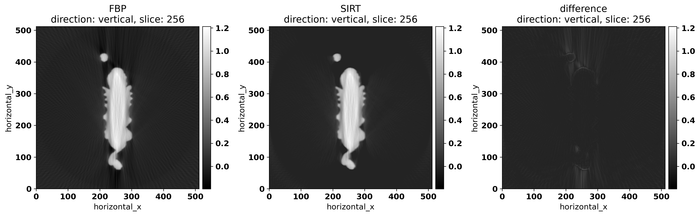
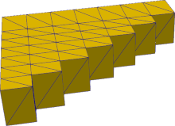
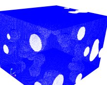

[](https://gvirtualxray.sourceforge.io/)

# X-ray simulations with [gVXR](https://gvirtualxray.sourceforge.io/) as a useful tool for education, data analysis, set-up of CT scans, and scanner development (Invited Paper)


Franck P. Vidal<sup>a,b,*</sup>,
Shaghayegh Afshari<sup>c</sup>,
Sharif Ahmed<sup>d</sup>,
Carolyn Atkins<sup>e</sup>,
&Eacute;ric B&eacute;chet<sup>f</sup>,
Alberto Corb&iacute; Bellot<sup>g</sup>,
Stefan Bosse<sup>h,i</sup>,
Younes Chahid<sup>e</sup>,
Cheng-Ying Chou<sup>c</sup>,
Robert Culver<sup>j</sup>,
Lewis Dixon<sup>b</sup>,
Mart&iacute; Puig Fantauzzi<sup>k,l</sup>,
Johan Friemann<sup>m</sup>,
Amin Garbout<sup>l</sup>,
Cl&eacute;mentine Hatton<sup>n</sup>,
Audrey Henry<sup>n</sup>,
Christophe Leblanc<sup>f</sup>,
Alberto Leonardi<sup>d</sup>,
Jean Michel L&eacute;tang<sup>o</sup>,
Harry Lipscomb<sup>l</sup>,
Tristan Manchester<sup>d</sup>,
Bas Meere<sup>p</sup>,
Simon Middleburgh<sup>b</sup>,
Iwan Mitchell<sup>b</sup>,
Liam Perera<sup>d</sup>, and 
Jenna Tugwell-Allsup<sup>q</sup>


<i><sup>a</sup>Scientific Computing, Ada Lovelace Centre, Science Technology Facilities Council, UK</i><br>

<i><sup>b</sup>School of Computer Science \& Engineering, Bangor University, UK</i><br>

<i><sup>c</sup>Department of Biomechatronics Engineering, National Taiwan University, Taiwan</i><br>

<i><sup>d</sup>DIAD beamline, Diamond Light Source, UK</i><br>

<i><sup>e</sup>UK Astronomy Technology Centre, Royal Observatory, Edinburgh, UK</i><br>

<i><sup>f</sup>D&eacute;partement d'A&eacute;rospatiale et M&eacute;canique, Universit&eacute; de Li&egrave;ge, Belgium</i><br>

<i><sup>g</sup>Escuela Superior de Ingenier&iacute;a y Tecnolog&iacute;a - Universidad Internacional de La Rioja, Spain</i><br>

<i><sup>h</sup>Department of Computer Science, University of Koblenz, Koblenz, Germany</i><br>

<i><sup>i</sup>Department of Mechanical Engineering, University of Siegen, Siegen, Germany</i><br>

<i><sup>j</sup>The Manufacturing Technology Centre, UK</i><br>

<i><sup>k</sup>Department of Engineering Science, University of Oxford, UK</i><br>

<i><sup>l</sup>Henry Royce Institute, Henry Moseley X-ray Imaging Facility, Department of Materials, The University of Manchester, UK</i><br>

<i><sup>m</sup>Department of Industrial and Materials Science, Chalmers University of Technology, Sweden</i><br>

<i><sup>n</sup>Scalian DS, Rennes, France </i><br>

<i><sup>o</sup>INSA‐Lyon, Université Claude Bernard Lyon 1, CNRS, Inserm, CREATIS UMR 5220, U1294, Lyon, France</i><br>

<i><sup>p</sup>Department of Mechanical Engineering, Eindhoven University of Technology, Netherlands</i><br>

<i><sup>q</sup>Radiology Department, Betsi Cadwaladr University Health Board (BCUHB), Ysbyty Gwynedd, UK</i><br>

<i><sup>*</sup> Corresponding author</i>

Accepted for publication in [Developments in X-Ray Tomography XV, SPIE Optics + Photonics](https://spie.org/OPO/conferencedetails/x-ray-tomography) (19-22 Aug 2024)

## Abstract

gVirtualXray (gVXR) is an open-source framework that relies on the Beer-Lambert law to simulate X-ray images in real time on a graphics processor unit (GPU) using triangular meshes. A wide range of programming languages is supported (C/C++, Python, R, Ruby, Tcl, C#, Java, and GNU Octave). Simulations generated with gVXR have been benchmarked with clinically realistic phantoms (i.e. complex structures and materials) using Monte Carlo (MC) simulations, real radiographs and real digitally reconstructed radiographs (DRRs), and X-ray computed tomography (XCT). It has been used in a wide range of applications, including real-time medical simulators, proposing a new densitometric radiographic modality in clinical imaging, studying noise removal techniques in fluoroscopy, teaching particle physics and X-ray imaging to undergraduate students in engineering, and XCT to masters students, predicting image quality and artifacts in material science, etc. gVXR has also been used to produce a high number of realistic simulated images in optimization problems and to train machine learning algorithms.

## Keywords

X-ray imaging, computed tomography, simulation, GPU programming

## Content

- **environment.yml**: Conda environment file.
- **code**: In this directory, you' find Jupyter notebooks and Python scripts to simulate CT scan acquisition data with [gVXR](https://gvirtualxray.sourceforge.io/), reconstruct them using [CIL](https://ccpi.ac.uk/cil/), as well as the Jupyter notebooks used to generate some of the figures of the paper on
    - **dragon-without-JSON.ipynb** and **dragon-without-JSON.py** are the Jupyter Notebook and the corresponding Python script that show how to load a STL file and simulate a complete CT scan acquisition, inc. a scintillator, a detector impulse response, tube anode angle, tube voltage, beam filtration, exposure, mono-material sample (mixture). The python API is used for the simulation. We also show how to reconstruct the data using both FDK and SIRT (iterative method).
        
        

    - **dragon-with-JSON.ipynb** and **dragon-with-JSON.py** are used to perform the same simulation, but this time the simulation parameters are described in a user-friendly JSON file.

    - **step-wedge.ipynb** is a Jupyter Notebook that shows how to simulate a CT scan of a step wedge. The user can interactively modify the geometrical property of the step wedge. The phantom is created using a function built in gVXR.

        

    - **foam.ipynb** is a Jupyter Notebook that shows how to simulate a CT scan of a cuboid made of foam. The user can interactively modify the property of the foam. The phantom is created using a function built in gVXR.

        

    - **find_energy-mock_fuel.ipynb** is the Jupyter Notebook that we used to plan our experiment at the [I12 beamline](https://www.diamond.ac.uk/Instruments/Imaging-and-Microscopy/I12.html) of the [Diamond Light Source](https://www.diamond.ac.uk/) synchrotron.

    - **mock_fuel-without-JSON.ipynb** shows how to simulate a CT scan of a mock nuclear fuel pellet based on the [I12 beamline](https://www.diamond.ac.uk/Instruments/Imaging-and-Microscopy/I12.html) of the [Diamond Light Source](https://www.diamond.ac.uk/) synchrotron.

    - **mock_fuel-experimental.ipynb** is the Jupyter Notebook that we used to reconstruct experimental data of a mock nuclear fuel pellet scanned at the [I12 beamline](https://www.diamond.ac.uk/Instruments/Imaging-and-Microscopy/I12.html) of the [Diamond Light Source](https://www.diamond.ac.uk/) synchrotron with different energies.

    - **create-figures.ipynb** is the Jupyter Notebook that we used to create some of the figures.

## Requirements

You must install Conda. See [https://conda.io/projects/conda/en/latest/user-guide/install/index.html](https://conda.io/projects/conda/en/latest/user-guide/install/index.html) for more information.


## Installation

```bash
conda  env create -f environment.yml
```

## Related software projects

- [gVirtualXray (gVXR)](http://gvirtualxray.sourceforge.io/) provides a programming framework for simulating X-ray images on the graphics processor unit (GPU) using OpenGL. In a nutshell, it computes the polychromatic version of the Beer-Lambert law (the mathematical model that relates the attenuation of X-ray photons to the properties of the material through which the photons are travelling) on the graphics card from polygon meshes.
- [xraylib](https://github.com/tschoonj/xraylib) provides the mass attenuation coefficients used by gVXR.
- The [Core Imaging Library (CIL)](https://ccpi.ac.uk/cil/) is an open-source mainly Python framework for tomographic imaging for cone and parallel beam geometries. It comes with tools for loading, preprocessing, reconstructing and visualising tomographic data.
- [SpekPy](https://bitbucket.org/spekpy/spekpy_release/wiki/Home) is a free software toolkit for calculating and manipulating x-ray tube spectra.
- [xpecgen](https://github.com/Dih5/xpecgen/) is a free software toolkit for calculating and manipulating x-ray tube spectra.
- [Gate](http://www.opengatecollaboration.org/) is an open-source software dedicated to numerical simulations in medical imaging and radiotherapy based on [Geant4](https://geant4.web.cern.ch/), the general-purpose Monte Carlo (MC) code by the European Organization for Nuclear Research (CERN).
- [SimpleITK](https://simpleitk.org/) is an open-source multi-dimensional image analysis in Python, R, Java, C#, Lua, Ruby, TCL and C++. Developed by the [Insight Toolkit](https://www.itk.org/) community for the biomedical sciences and beyond.

## References

TBA
