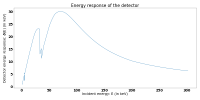
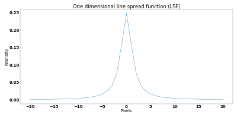
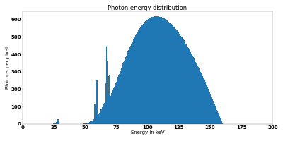
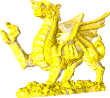

# gVXR-SPIE2024

- code
    - CT scan acquisition simulation using [gVXR](https://gvirtualxray.sourceforge.io/) and CT reconstruction with [CIL](https://ccpi.ac.uk/cil/). The python API is used for the simulation. This is a full example with kV, filtration, mAs, scintillator and impulse response (see table below). Both FDK and SIRT (iterative method) reconstructions were performed. 
        
        

        | Parameter | Value |
        |-----------|-------|
        | source-to-object distance (SOD) | 150 cm |
        | object-to-detector distance (ODD) | 40 cm |
        | source-to-detector distance (SDD) | 190 cm |
        | detector resolution | 512 &times; 512 pixels |
        | pixel pitch | 500 &times; 500 &mu;m |
        | scintillator | 500 &mu;m of CsI|
        | energy response of the detector |  |
        | detector impulse response |  |
        | tube anode material | tungsten |
        | tube anode angle | 10&deg; |
        | tube voltage | 160 kV |
        | beam filtration | 1mm of Sn |
        | tube exposure | 0.5 mAs |
        | beam spectrum |  |
        | sample geometry |  |
        | sample material composition | Ti90Al6V4 |
        | sample material density | 4.43 g/cm3|
        | number of projection | 200 |
        | first angle | 0&deg; |
        | last angle | 360&deg; |
        | number of flat images | 60 |
        - dragon-without-JSON.ipynb: interactive notebook
        - dragon-without-JSON.py: python script
    - It is the same as previously, but make use of the JSON API to set the simulation. The JSON file format is relatively user friendly. It is much easier to describe the simulation parameters as no code is needed.
        - dragon-with-JSON.ipynb: interactive notebook
        - dragon-with-JSON.py: python script

        - dragon-without-JSON-simplified.py: same python script as dragon-without-JSON.py, but without any visualisation
        - dragon-with-JSON-simplified.py: same python script as dragon-with-JSON.py, but without any visualisation
